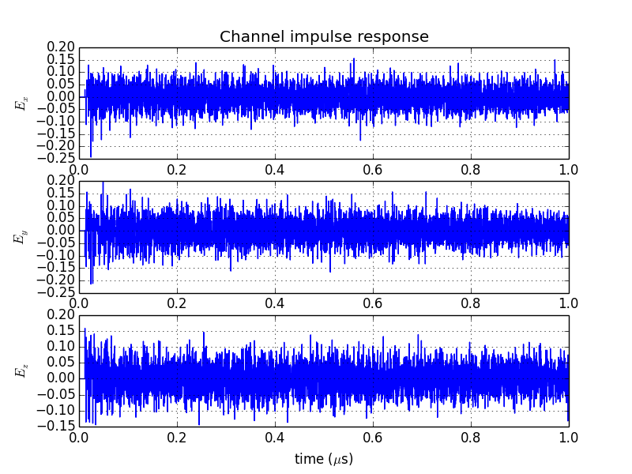
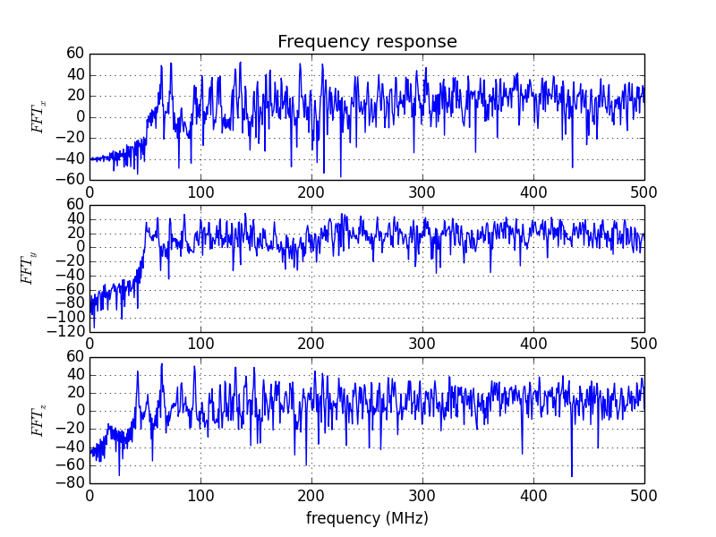

pyRC
====

Overview
--------

This a python code that computes the electric field in an electromagnetic reverberation chamber in the time domain or in the frequency domain.
This model is based on image theory.
This model represents the work done during my Ph.D.
By using this software, you agree to credit the authors: Emmanuel Amador, Philippe Besnier and Christophe Lemoine from the Institut d'Électronique et de Télécommunications de Rennes IETR and the main article describing this model:

E. Amador, C. Lemoine, P. Besnier, and A. Laisné, “Reverberation chamber modeling based on image theory: Investigation in the pulse regime,” *Electromagnetic Compatibility, IEEE Transactions on, vol. 52, no. 4*, pp. 778 – 789, 2010.

http://dx.doi.org/10.1109/TEMC.2010.2049576

You can use the source-code and make modifications to suit your needs. You cannot distribute this software or an altered version of this software without authors' permissions.

Comments and suggestions are greatly welcomed.

**Warning**, the code is not optimized yet, most of it is a rough adaptation of a Matlab code.

visit http://projets.ietr.fr/imagetheorymodel/ for more details.

Requirements
------------

* Python 2.x
* Numpy
* Matplotlib
* A lot of memory...

Content
-------
* Functions imported
  - `Image_Creator.py` contains a function that generates the dipole images in all the image cavities
  - `CIR.py`contains the functions used to compute the channel impulse response of the dipoles
  - `FR.py`contains the funtions used to compute the response in the frequency domain

* Example programs: in these examples a 8.7x3.7x2.9 m^3 cavity is modelled. A dipole is placed inside and the reposne in time domain and frequency domain is computed.
  - `ExampleCIR.py`is a sample program that computes the channel impulse response in the time domain. A FFT is used to get the frequency response.
 Channel impulse response:
 
FFT:

  - `ExampleFR.py` is a sample program that computes directly the frequency response of the dipole in the cavity.
  Frequency response:
  
